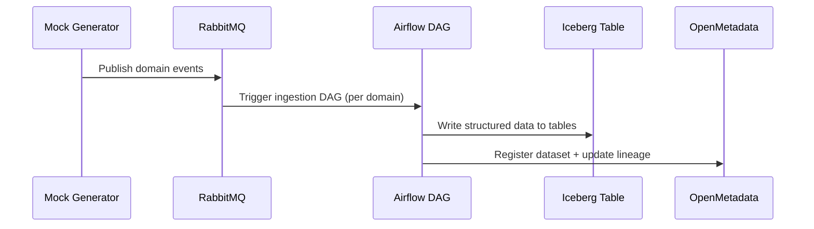
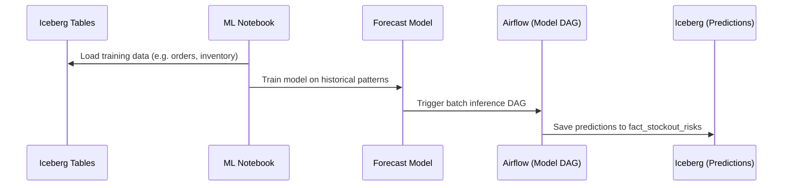
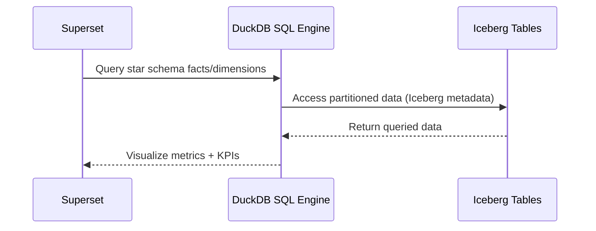

# The Mesh-terious Warehouse

**The Mesh-terious Warehouse** is an opinionated data analytics project built to demystify modern data architecture patterns — one warehouse event at a time.

If you've ever wondered how **Lakehouse**, **Data Mesh**, and **Data Fabric** are supposed to work (and whether they can coexist without a data war), this project is your guided tour through the chaos — minus the vendor slides.

This isn’t a shiny reference implementation or a polished sandbox. It’s a pragmatic, hands-on learning project meant to answer one question:
**“What actually happens when you try to implement these architecture patterns together?”**

Here’s what this project attempts to untangle:

* Can warehouse teams publish to a Lakehouse without stepping on each other’s schemas?
* Can a logistics team find anything without shouting into Slack?
* Can metadata governance exist without a meeting invite?
* And can ML predictions be versioned like code and not lost in a CSV on someone’s desktop?

To find out, this project brings together:

* **Apache Iceberg** and **DuckDB** to simulate Lakehouse storage and querying
* A **Data Mesh**-like domain structure where each team owns its data pipelines
* An **OpenMetadata-powered Data Fabric** to stitch it all together (and tell who broke what, when)

If it works, great. If not, at least we’ll know why the dashboards are blank.

## Project Context

Welcome to **ACME Corp**, where dreams are delivered — often late, sometimes misrouted, and occasionally returned by mistake.

ACME is a sprawling global retail-and-logistics giant, with four regional warehouses, a central logistics team, and an ambitious ML squad called “the Insight Avengers.” For years, each team operated in glorious data independence — Excel sheets in the east, SQL scripts in the west, and Post-it notes in the north.

Naturally, chaos followed.

**Duplicate KPIs. Conflicting dashboards. Mysterious metrics.** And a company-wide Slack thread titled *“Why does 'inventory\_available' mean five different things?”*

ACME decided to untangle this mess by attempting the unthinkable:

* **Let warehouse teams own their own data** (aka, *"Data Mesh, but without the TED talk"*)
* **Store everything in one open format, not ten** (thanks, **Lakehouse**)
* **Track where the data came from and who broke it last** (cue **Data Fabric** and its metadata magic)

Each team embraced the transformation in their own way:

* **Rita** from the North Warehouse finally stopped emailing CSVs and now pushes dispatch logs straight to Iceberg.
* **Manoj** from Logistics uses unified route and order metrics to tell drivers where *not* to go.
* **Fatima**, the ML engineer, builds predictive models that occasionally outperform “gut feel.”
* **Trisha**, the data steward, uses OpenMetadata to track freshness, lineage, and who last edited that one dbt model at 2am.
* **Ajay** runs queries so fast on DuckDB, people assume it’s magic. It’s just partitions.
* And **Mei** ensures that ACME’s data is clean, compliant, and only mildly terrifying to auditors.

Together, they’ve built what we now call **The Mesh-terious Warehouse** — a place where modern data architectures aren’t just buzzwords… they’re coping mechanisms.

## Domain Structure and Data Ownership

This project adopts **Data Mesh** principles to ensure scalability, accountability, and agility across teams. Each functional domain owns its own ingestion, transformation, and documentation pipeline.

### Defined Domains

| Domain            | Responsible Team       | Key Data Products                                                                                                 |
| ----------------- | ---------------------- | ----------------------------------------------------------------------------------------------------------------- |
| `north_warehouse` | North Ops Team         | `orders_north`, `inventory_north`, `returns_north`, `restocks_north`, `order_errors_north`, `dispatch_logs_north` |
| `south_warehouse` | South Ops Team         | `orders_south`, `inventory_south`, `returns_south`, `restocks_south`, `order_errors_south`, `dispatch_logs_south` |
| `east_warehouse`  | East Ops Team          | `orders_east`, `inventory_east`, `returns_east`, `restocks_east`, `order_errors_east`, `dispatch_logs_east`       |
| `west_warehouse`  | West Ops Team          | `orders_west`, `inventory_west`, `returns_west`, `restocks_west`, `order_errors_west`, `dispatch_logs_west`       |
| `logistics_core`  | Central Logistics Team | `vehicle_tracking`, `delivery_sla`, `routes`                                                                      |
| `ml_insights`     | ML/Forecasting Team    | `demand_forecast`, `sla_risk`, `stockout_risk`                                                                    |

Each team manages its data using separate dbt models, Airflow DAGs, and RabbitMQ producers, enabling independent evolution and deployment of pipelines.

## Data Model Design

This project uses a **Lakehouse Star Schema** to combine flexibility with performance.

## Project Layout

- `docker-compose.yml`: Orchestrates MinIO, RabbitMQ, Iceberg REST, Airflow, OpenMetadata, and Superset
- `ingestion/producers/`: Mock event generators per domain (orders, returns, inventory, logistics_core, ml_insights)
- `dags/`: Airflow DAGs per subject area with per-region ingestion, staging, and fact loads
- `dags/*_dags/curate_*`: Airflow curation DAGs writing facts/dims to Iceberg
- `superset/`: Bootstrap for DuckDB connection and example queries
- `notebooks/`: ML notebooks for forecasting and analysis

### Fact Tables (Expanded)

* `fact_orders`: transactions per warehouse
* `fact_returns`: return activity by order and reason
* `fact_inventory_movements`: stock level changes, restocks, and adjustments
* `fact_vehicle_routes`: route assignments and tracking
* `fact_dispatch_logs`: outbound logistics and load assignments
* `fact_order_errors`: failed transactions, SLA misses, and system issues
* `fact_forecast_demand`: projected demand curves per product and region
* `fact_stockout_risks`: ML outputs indicating potential shortages

### Dimension Tables

* `dim_warehouse`: warehouse metadata and location
* `dim_vehicle`: vehicle details and operational zone
* `dim_product`: SKU-level product metadata
* `dim_date`: day, month, quarter, year
* `dim_customer`: optional if simulating user behavior
* `dim_employee`: logistics personnel metadata for fulfillment and dispatch
* `dim_route`: static route metadata (e.g., region coverage, stops, average time)
* `dim_error_code`: standard codes and definitions for system and operational errors

All facts are partitioned and versioned using Apache Iceberg with full schema evolution and snapshot support.

## Lakehouse Principles

This project adheres to all major **Lakehouse** architecture principles:

| Principle                | This Implementation                                 |
| ------------------------ | --------------------------------------------------------- |
| Open Format              | Apache Iceberg (columnar, table-format on MinIO)          |
| ACID Transactions        | Iceberg snapshot and metadata-based transaction layer     |
| Schema Evolution         | Fully supported Iceberg schema changes per domain         |
| Unified Storage          | One object store (MinIO) for raw, cleaned, modeled data   |
| Batch + Streaming Ingest | RabbitMQ + Airflow pipelines per domain                   |
| BI + ML Interoperability | Shared Iceberg tables accessed by DuckDB and ML notebooks |
| SQL Analytics            | dbt and Superset queries run directly on Iceberg tables   |
| Data Versioning          | Snapshots, rollback, and time travel supported            |

Lakehouse tables are maintained in **Star Schema**, optimized for both exploration and machine learning workflows.

## Data Mesh

This project operationalizes the four pillars of **Data Mesh**:

### 1. Domain-Oriented Ownership

* Each warehouse, logistics, and ML team manages their own data pipelines end-to-end.
* Domains are structured as independent units within the repository via per-subject Airflow DAG packages under `dags/*_dags/` and per-domain generators under `ingestion/producers/<domain>/`.
* Teams own ingestion, transformation (dbt), metadata, and KPIs.

### 2. Data as a Product

* Each data product is versioned, documented, and has an explicit owner in OpenMetadata.
* dbt models are documented with freshness policies, business definitions, and expectations.

### 3. Self-Serve Infrastructure

* Shared DuckDB, MinIO, Airflow, Superset, and OpenMetadata are centrally provisioned.
* Teams use templates and automation to deploy domain-specific Airflow DAGs and metadata ingestion.

### 4. Federated Governance

* Metadata policies, ownership, and glossary definitions are enforced centrally.
* Domains retain flexibility while operating under global standards (naming, freshness, lineage tagging).

## Data Fabric

This project integrates a **Data Fabric** layer to provide enterprise-grade metadata and governance across decentralized domains.

### Key Fabric Features and Implementation

| Feature                     | Implementation in this project                         |
| --------------------------- | ------------------------------------------------------ |
| Unified Metadata Catalog    | OpenMetadata ingests all Iceberg tables and dbt models |
| Ownership and Tagging       | Domain ownership, update frequency, sensitivity labels |
| Lineage Tracking            | From RabbitMQ → Airflow → Iceberg → dbt → Superset     |
| Glossary and Business Terms | Defined in OpenMetadata and linked to columns/models   |
| Policy Enforcement          | Column-level PII and sensitive tags with access roles  |
| Search and Discovery        | Unified search UI for technical and business users     |

OpenMetadata serves as the **discovery and governance hub** for all data products across domains, enabling self-service analytics while maintaining compliance and oversight.

## Orchestration and Ingestion

* **RabbitMQ** handles decoupled, real-time ingestion of events from domain services.
* **Apache Airflow** DAGs consume events, validate payloads, and load structured records into Iceberg tables.
* Ingestion DAGs are defined per domain and registered automatically with metadata.

Developer note: Transformations are implemented as Airflow DAGs that read raw Iceberg tables and materialize curated facts/dims back to Iceberg. The previous dbt project and SQL DDLs were removed to avoid duplication.

## Mock Data Generators by Domain

Each domain simulates its own operational activity through dedicated mock data generators. These scripts produce synthetic JSON events to RabbitMQ queues, organized under `/ingestion/producers/<domain>/`.

### Events Per Domain

| Domain            | Events Emitted                                                                                                                |
| ----------------- | ----------------------------------------------------------------------------------------------------------------------------- |
| Warehouses (each) | `order_created`, `order_returned`, `inventory_movement`, `order_error_event`, `inventory_restock_event`, `dispatch_log_event` |
| Logistics Core    | `vehicle_tracking`, `route_update`, `delivery_sla_event`                                                                      |
| ML/Forecasting    | `demand_forecast_generated`, `sla_risk_predicted`, `stockout_risk_predicted`                                                  |

### Example Generator Matrix

| Domain            | Generator Scripts (per event type)                                                                                                                                            |
| ----------------- | ----------------------------------------------------------------------------------------------------------------------------------------------------------------------------- |
| `north_warehouse` | `produce_orders_north.py`, `produce_returns_north.py`, `produce_inventory_north.py`, `produce_errors_north.py`, `produce_restocks_north.py`, `produce_dispatch_logs_north.py` |
| `south_warehouse` | `produce_orders_south.py`, `produce_returns_south.py`, `produce_inventory_south.py`, `produce_errors_south.py`, `produce_restocks_south.py`, `produce_dispatch_logs_south.py` |
| `east_warehouse`  | `produce_orders_east.py`, `produce_returns_east.py`, `produce_inventory_east.py`, `produce_errors_east.py`, `produce_restocks_east.py`, `produce_dispatch_logs_east.py`       |
| `west_warehouse`  | `produce_orders_west.py`, `produce_returns_west.py`, `produce_inventory_west.py`, `produce_errors_west.py`, `produce_restocks_west.py`, `produce_dispatch_logs_west.py`       |
| `logistics_core`  | `produce_vehicle_tracking.py`, `produce_route_updates.py`, `produce_delivery_sla.py`                                                                                          |
| `ml_insights`     | `produce_demand_forecast.py`, `produce_sla_risk.py`, `produce_stockout_risk.py`                                                                                               |

Each script supports:

* `live mode`: periodic events (e.g., every 10 seconds)
* `burst mode`: simulate peak loads
* `replay mode`: emit from static `.csv` payloads
  
## Analytics and ML Use Cases

* Track and compare delivery SLA violations by vehicle type and region
* Forecast stockouts based on historical demand and active inventory levels
* Detect order anomalies and trigger operational alerts
* Train ML models directly on star-schema fact and dimension tables without exporting data

## System Flow Diagrams

### 1. Domain Event Ingestion Flow

### 2. Forecasting Workflow (ML Domain)

### 3. Superset Dashboard Exploration

## Summary

This project is a reference implementation for building modern, enterprise-grade analytics platforms that combine:

* **Lakehouse**: Unified, governed, high-performance analytical storage
* **Data Mesh**: Decentralized domain ownership and team accountability
* **Data Fabric**: Centralized discovery, metadata, and policy enforcement

The result is a system that supports independent team operations, shared intelligence, and future-ready data governance.

## Testing

Run tests with `pytest -v`. Tests include per-domain DuckDB view checks that configure S3/Iceberg in DuckDB and probe Iceberg tables in MinIO. Each test fails if its backing table is missing or if the resulting view is empty (requires > 0 rows).

Use the DuckDB from the Docker volume for quick verification:

1) Ensure the stack has run at least once (so `/data/warehouse.duckdb` exists in the `duckdb_data` volume):

   docker compose up -d

2) Copy the DuckDB file out of the `duckdb_data` volume into the local `tests/` folder and point tests at it:

   export DUCKDB_PATH="$(pwd)/tests/warehouse.duckdb"
   docker run --rm -v duckdb_data:/data -v "$PWD/tests":/host alpine:3.19 \
     sh -c "cp -f /data/warehouse.duckdb /host/ && ls -lh /host/warehouse.duckdb"

3) Run the tests:

   pytest

Notes:
- The named volume is declared as `duckdb_data` in `docker-compose.yml` and is mounted at `/data` in services.
- Ensure ingestion/curation DAGs have produced data; tests fail if a data product is missing or has zero rows.
